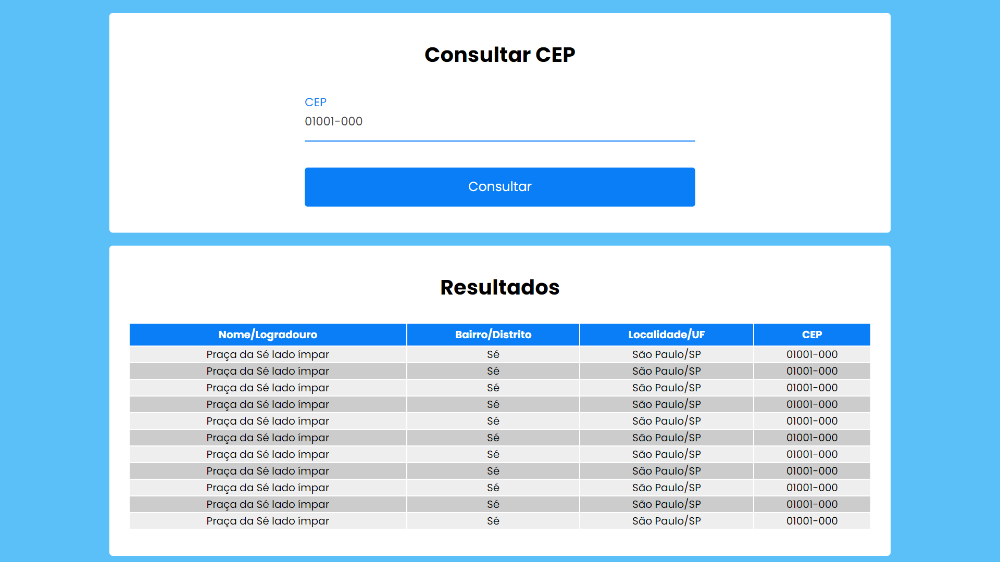

# Consulta CEP

> Um buscador de CEP que fornece as informações essenciais sobre o que foi inserido. Este projeto foi motivado pela necessidade de entender programação assíncrona, pois estava com grandes dificuldades.
API utilizada: [ViaCEP](https://viacep.com.br/)

## ☕ Utilizando o Busca CEP

Para poder testar este projeto, você pode entrar [neste link](https://bit.ly/ybruno0709prj2).
